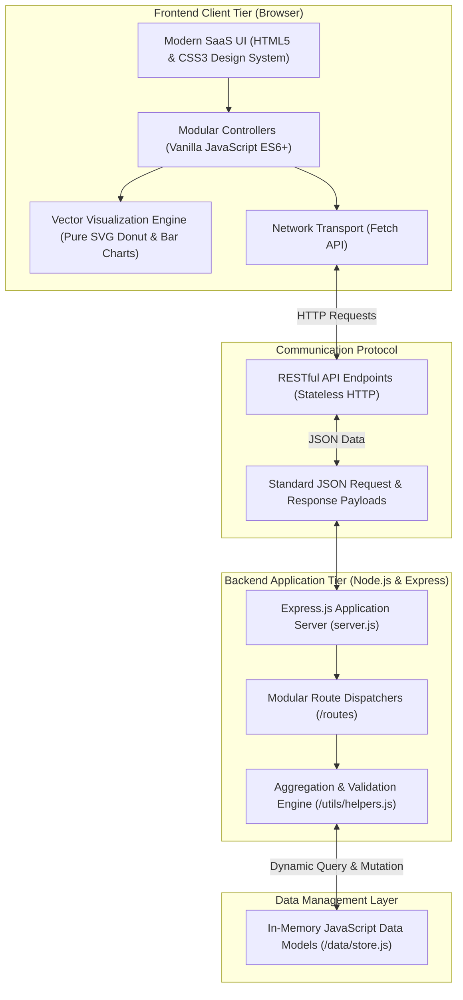

# EMS — Event Management System

> **Plan Better. Coordinate Smarter. Deliver Great Events.**  
> *A centralized, web-based event operations command center for event organizers.*  
> **Subject:** Cloud Computing | **Project Type:** Micro-Project

---

## 1. Project Overview & Identity

**EMS (Event Management System)** is a modern, responsive web application engineered specifically for event organizers to coordinate, monitor, and execute events from a centralized command center.

### Core Distinction: EMS vs. Eventra

A critical distinction must be maintained between public ticket-booking apps and internal operations command systems:

| Dimension | Eventra (Public Booking) | EMS (Organizer Command Center) |
| :--- | :--- | :--- |
| **Primary Audience** | Public attendees, ticket buyers | Internal event organizers, committee leads, crew |
| **Primary Focus** | Event discovery, ticketing tiers, ticket booking | Run-of-show schedules, volunteer rosters, checklists, budgets |
| **Key Activities** | Seat selection, checkout, payment gateway | Session timeline management, task delegation, speaker confirmation |
| **Outcome** | Issued QR tickets & confirmation emails | Operational readiness score, financial ledger, execution dossier |

**EMS is strictly an Event Operations & Planning Command Center, not another ticket-booking portal.**

---

## 2. System Architecture

The application implements a clean, cloud-ready client-server architecture. Presentation, routing, business logic, and in-memory data storage are cleanly decoupled.



---

## 3. Cloud Computing Relevance

> **Viva Explanation:**  
> *"EMS follows a cloud-ready client-server architecture where the frontend communicates with a Node.js backend through REST APIs using stateless HTTP and JSON. The complete separation of presentation and application logic allows the system to be deployed directly onto cloud infrastructure (such as AWS EC2, Azure App Services, or Google Cloud Run) without redesigning its core architecture."*

### Key Cloud Computing Concepts Demonstrated:
1. **Client-Server Architecture:** Complete separation between the browser presentation layer and the Node.js server.
2. **Stateless HTTP REST APIs:** Every API request carries full contextual parameters without relying on server-side session locks.
3. **Decoupled Frontend & Backend:** Client views communicate exclusively via JSON payloads through the browser's standard `Fetch API`.
4. **Centralized Server-Side Processing:** Aggregations for budget spending, completion rates, and event readiness indices are calculated centrally on the server.
5. **Cloud-Ready Infrastructure Design:** Configurable runtime ports (`process.env.PORT`) and standard structure ready for containerization (`Docker`).
6. **Architectural Honesty (Zero Cloud Bloat):** The system intentionally avoids unnecessary third-party cloud database dependencies (no MongoDB, Firebase, Supabase, Cloudinary, AWS SDK), ensuring truthful evaluation.

---

## 4. Main Modules & Operational Capabilities

### 1. Dashboard — Event Command Center
- **Dynamic Event Statistics:** Real-time counters for Total, Upcoming, Active, and Completed events.
- **Operations Metrics:** Real-time calculation of total tasks, completion rates, team headcount, and confirmed speakers.
- **Financial Ledger Summary:** Planned budget, actual spent, remaining balance, and utilization percentages.
- **Upcoming Timeline Feed:** Animated chronological schedule view of upcoming sessions.
- **Operational Broadcasts:** High-priority alerts with glowing badges and slide-in animations.

### 2. Event Readiness Index (Dynamic Formula)
Readiness is calculated dynamically from five weighted operational factors:
- **Tasks Completion Factor (35% weight):** Ratio of completed tasks to total checklist items.
- **Team Allocation Factor (20% weight):** Ratio of assigned and active personnel to total roles.
- **Schedule Preparation Factor (20% weight):** Ratio of scheduled sessions to total planned sessions.
- **Speaker Confirmation Factor (15% weight):** Ratio of confirmed keynote guests to total invited speakers.
- **Budget Compliance Factor (10% weight):** Financial preparedness based on committed and tracked expenses.

### 3. Dedicated Event Workspace
A focused command workspace for any selected event:
- **Overview:** Readiness score gauge, event vitals, quick-access agenda, and action checklist.
- **Schedule:** Chronological run-of-show timeline with speaker badges.
- **Team:** Assigned crew cards and department rosters.
- **Tasks:** Interactive checklist with one-click status toggling (`Pending` / `Completed`).
- **Budget:** Financial expense ledger with category allocations.
- **Guests:** Speaker profiles with confirmation status pills (`Confirmed`, `Pending`, `Declined`).
- **Announcements:** Published broadcasts with priority tags (`Urgent`, `Important`, `Normal`).
- **Visual Analytics:** SVG vector donut charts and comparative dual bar graphs (Planned vs. Actual).

### 4. Schedule & Run-of-Show Management
- Chronological session management with start/end timings, halls/venues, keynote speakers, and session briefs.
- Filter by event, status, or search query.

### 5. Team & Volunteer Management
- Departmental rosters: *Event Coordinator, Registration, Technical Team, Hospitality, Stage Management, Photography, Security, Volunteer*.
- Real-time availability tracking (*Available, Assigned, Busy, Completed*) and assigned task counts.

### 6. Tasks & Execution Checklist
- Priority classification (*Critical, High, Medium, Low*) with deadline indicators.
- Instant status toggling with dynamic readiness recalculation.

### 7. Budget & Financial Ledger
- Categorized expense tracking: *Venue, Food, Decoration, Equipment, Marketing, Transportation, Photography, Miscellaneous*.
- Visual analytics: Vector SVG donut charts for category shares and comparative bar graphs for budget vs. actual spent.

### 8. Guests & Keynote Speakers
- Profiles with name, designation, organization, topic, and session linkage.
- Real-time confirmation management (*Confirmed, Pending, Declined*).

### 9. Operational Announcements & Broadcasts
- Priority-tagged alerts (*Normal, Important, Urgent*) with glowing cards and slide-in animations for crew awareness.

### 10. Multi-Entity Global Search (`Ctrl+K`)
- Instant search across events, tasks, schedules, team members, and speakers simultaneously.

### 11. Standalone Print & PDF Dossier Engine
- Generates a vector event operations report in an isolated window with print-specific CSS, removing all navigation and controls for clean "Save as PDF" output.

### 12. Theme Engine (Light / Dark Mode)
- Full contrast compliance across both modes with persistence in `localStorage`.

---

## 5. REST API Reference

| Method | Endpoint | Description |
| :--- | :--- | :--- |
| `GET` | `/api/dashboard` | Aggregated command center metrics, readiness & timeline |
| `GET` | `/api/events` | List events with status, type, and search filters |
| `GET` | `/api/events/:id` | Get specific event with calculated readiness breakdown |
| `POST` | `/api/events` | Create a new event |
| `PATCH` | `/api/events/:id` | Update event details |
| `DELETE` | `/api/events/:id` | Delete event (cascades cleanup of child entities) |
| `GET` | `/api/events/:id/schedule` | Get scheduled sessions for an event |
| `POST` | `/api/events/:id/schedule` | Schedule a new session |
| `PATCH` | `/api/schedule/:id` | Update session timings or details |
| `DELETE` | `/api/schedule/:id` | Delete a scheduled session |
| `GET` | `/api/events/:id/team` | List team members assigned to an event |
| `POST` | `/api/events/:id/team` | Assign a new team member |
| `PATCH` | `/api/team/:id` | Update member status or role |
| `DELETE` | `/api/team/:id` | Remove a team member |
| `GET` | `/api/events/:id/tasks` | Get checklist tasks and progress |
| `POST` | `/api/events/:id/tasks` | Create a new operational task |
| `PATCH` | `/api/tasks/:id` | Update task or toggle status (`Pending` / `Completed`) |
| `DELETE` | `/api/tasks/:id` | Delete a task |
| `GET` | `/api/events/:id/budget` | Get budget items and category breakdown |
| `POST` | `/api/events/:id/budget` | Record a new expense |
| `PATCH` | `/api/budget/:id` | Update expense amount or status |
| `DELETE` | `/api/budget/:id` | Delete an expense record |
| `GET` | `/api/events/:id/guests` | List invited guests and keynote speakers |
| `POST` | `/api/events/:id/guests` | Register a new guest/speaker |
| `PATCH` | `/api/guests/:id` | Update confirmation status |
| `DELETE` | `/api/guests/:id` | Remove a guest/speaker |
| `GET` | `/api/events/:id/announcements` | List operational broadcasts |
| `POST` | `/api/events/:id/announcements` | Publish a new announcement |
| `PATCH` | `/api/announcements/:id` | Edit an announcement |
| `DELETE` | `/api/announcements/:id` | Delete an announcement |
| `GET` | `/api/events/:id/analytics` | Get event operations analytics & priority distribution |
| `GET` | `/api/search?q=...` | Multi-entity global search across all modules |
| `POST` | `/api/data/clear` | Clear data store to demonstrate dynamic 0-state binding |
| `POST` | `/api/data/restore` | Restore realistic sample data |

---

## 6. Installation & Execution Guide

### Prerequisites
- [Node.js](https://nodejs.org/) (v18 or higher recommended)
- `npm` (v9 or higher)

### Setup & Run
```bash
# 1. Navigate to the project directory
cd C:\Users\rosha\ems

# 2. Install dependencies (Express only)
npm install

# 3. Start the application server
npm start
# or
node server.js
```

### Accessing the Application
Open any modern web browser and navigate to:  
👉 **`http://localhost:3000`**

---

## 7. Project Structure

```text
ems/
├── data/
│   └── store.js           # In-memory data store with realistic event models
├── public/                # Frontend client files (served statically)
│   ├── css/
│   │   └── style.css      # SaaS design system, animations, themes, and print styles
│   ├── js/
│   │   ├── api.js         # API client, toast system, SVG chart generators, modal helpers
│   │   ├── dashboard.js   # Command center dashboard logic
│   │   ├── events.js      # Event catalog management
│   │   ├── workspace.js   # Dedicated event operations workspace
│   │   ├── schedule.js    # Run-of-show session scheduler
│   │   ├── team.js        # Team and volunteer roster controller
│   │   ├── tasks.js       # Operational checklist controller
│   │   ├── budget.js      # Budget and expense ledger controller
│   │   ├── guests.js      # Speaker and guest relations controller
│   │   └── announcements.js # Broadcast announcements controller
│   ├── index.html         # Dashboard view
│   ├── events.html        # Events catalog view
│   ├── workspace.html     # Dedicated event workspace view
│   ├── schedule.html      # Run-of-show schedule view
│   ├── team.html          # Team & volunteers view
│   ├── tasks.html         # Tasks & checklists view
│   ├── budget.html        # Budget & finance view
│   ├── guests.html        # Guests & speakers view
│   └── announcements.html # Announcements view
├── routes/                # Modular REST API endpoints
│   ├── dashboardRoutes.js
│   ├── eventRoutes.js
│   ├── scheduleRoutes.js
│   ├── teamRoutes.js
│   ├── taskRoutes.js
│   ├── budgetRoutes.js
│   ├── guestRoutes.js
│   ├── announcementRoutes.js
│   ├── analyticsRoutes.js
│   ├── searchRoutes.js
│   └── dataRoutes.js
├── utils/
│   └── helpers.js         # Business logic, validation, readiness, and aggregation engine
├── .gitignore             # Excludes node_modules, tests, logs, and OS artifacts
├── package.json           # Minimal configuration with Express dependency
├── README.md              # Project documentation and architecture guide
└── server.js              # Express application bootstrap and static server
```
