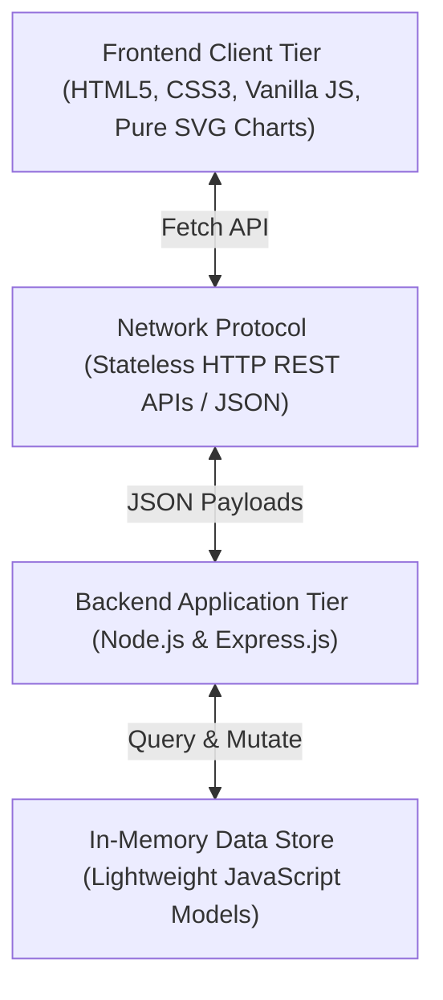

# EMS — Event Management System

> **Plan Better. Coordinate Smarter. Deliver Great Events.**  
> *A centralized, cloud-ready event operations command center for organizers.*  
> **Subject:** Cloud Computing | **Project Type:** Micro-Project

---

## 🚀 Overview

**EMS** is a modern web application built for event organizers to plan, coordinate, and execute events from a single centralized command center.

### ⚡ EMS vs. Eventra
- **Eventra:** Public event discovery & ticket booking.
- **EMS:** Internal event planning, operational checklists, run-of-show schedules, volunteer rosters, budgets, keynote speakers, and readiness scoring. **(Strictly internal event operations, not a ticket booking portal)**.

---

## 🏛️ System Architecture

EMS implements a decoupled, cloud-ready client-server architecture using standard HTTP REST APIs and JSON data interchange:



---

## ☁️ Cloud Computing Relevance

> **Viva Explanation:**  
> *"EMS demonstrates a cloud-ready client-server architecture where presentation and backend processing are cleanly decoupled. The browser communicates with a Node.js backend via stateless RESTful APIs over HTTP and JSON, allowing seamless deployment onto cloud platforms (e.g., AWS, Azure, GCP) without redesigning its core structure."*

- **Client-Server Separation:** Independent frontend presentation and backend services.
- **Stateless REST APIs:** No server-side session locks; payload-driven communication.
- **Centralized Processing:** Real-time server-side calculation for budgets, task completion, and readiness scores.
- **Zero Cloud Bloat:** Pure, honest micro-project architecture with zero external database dependencies.

---

## 🛠️ Technology Stack

- **Frontend:** HTML5, CSS3 (Modern SaaS Dark/Light design system), Vanilla JavaScript (ES6+), Fetch API, Pure SVG Vector Charts.
- **Backend:** Node.js, Express.js.
- **Data Layer:** Lightweight, structured in-memory JavaScript data models with realistic seed data.
- **API Protocol:** RESTful HTTP with JSON request/response payloads.

---

## 📋 Core Modules

1. **Operations Dashboard:** Live command center displaying event vitals, operation task checklists, financial summaries, upcoming timeline feeds, and urgent broadcasts.
2. **Event Readiness Score:** A 5-factor weighted index tracking task completion (35%), team assignment (20%), session scheduling (20%), speaker confirmation (15%), and budget compliance (10%).
3. **Dedicated Event Workspace:** Unified organizer hub with sub-tabs for Schedule, Team, Tasks, Budget, Speakers, Announcements, and Analytics.
4. **Run-of-Show Scheduler:** Chronological timeline tracking sessions, venues, speakers, and start/end times.
5. **Team & Volunteer Roster:** Departmental assignments and task tracking across 8 operational roles.
6. **Task & Checklist Management:** Priority-based task tracking with one-click status toggles and dynamic progress recalculation.
7. **Budget & Financial Ledger:** Expense tracking across 8 categories with pure SVG donut charts and comparative bar graphs.
8. **Guests & Keynote Speakers:** Profiles, presentation topics, and real-time confirmation tracking (*Confirmed, Pending, Declined*).
9. **Operational Broadcasts:** High-priority notices (*Urgent, Important, Normal*) with slide-in animations and pulsing alerts.
10. **Global Search (`Ctrl+K`):** Instant multi-entity search across all events, tasks, schedules, team members, and speakers.
11. **Print & PDF Dossier Engine:** Dedicated clean print view for official event operations summary reports.

---

## ⚡ Quick Start

### 1. Install Dependencies
```bash
npm install
```

### 2. Start Server
```bash
npm start
# or: node server.js
```

### 3. Open in Browser
Visit: **`http://localhost:3000`**
